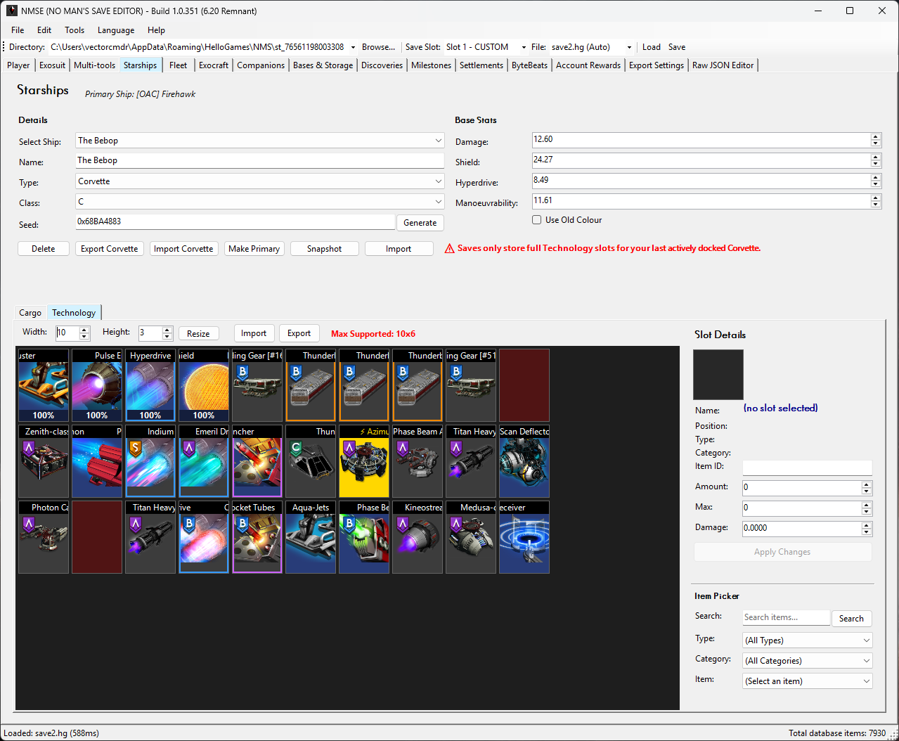

<div align="center">

> Preview builds are now live! 🎉

# NMSE (No Man's Save Editor)

[![Build Status][badge-build]][workflow-build]
[![GitHub Release][badge-release]][releases]
[![GitHub Stars][badge-stars]][repo]

[![License][badge-license]][license]
[![.NET][badge-dotnet]][dotnet]
[![Platform][badge-platform]][releases]

**NMSE** is a free, open-source desktop application for editing *No Man's Sky* save files.<br>
It supports every platform the game ships on - **Steam**, **GOG**, **Xbox Game Pass**, **PlayStation 4**, and **Nintendo Switch** - and handles each platform's unique file layout, compression, and encryption transparently.<br>

NMSE boasts the most complete set of editable items out of all available save editors.<br>
You can see a set of thorough comparisons between the two most popular editors [here][comparison].

[**Download Latest Release**][releases] · [**See The Website**][website] · [**Report a Bug**][issues-bug] · [**Request a Feature**][issues-feature] <br>
[**User Guide**][user-guide]

<br />

> **Latest Supported Game Version:** 6.20 *Remnant* (6.24)

</div>

---

## ✨ Features

<table>
<tr>
<td width="50%" valign="top">

### 👨‍🚀 Player & Stats
- Edit health, currency, units, nanites, quicksilver
- Switch game mode and difficulty presets
- Modify player state and galactic coordinates
- Unlock words, glyphs, and discoveries
- Full milestone and journey milestone editing
- Edit multitool inventory, type, class, and seed

### 🏗️ Bases, Settlements & Companions
- Edit base inventories and storage chests
- Settlement stats, production, and perks
- Edit corvette cache and salvage containers
- Edit fishing inventories and cooking ingredients
- Companion editing with creature builder

</td>
<td width="50%" valign="top">

### 🚀 Starships, Exocraft & Fleets
- Edit starships with full inventory access
- Change ship type, class, seed, and name
- Corvette editing, part reverse lookup, export and import
- Manage exocraft inventories and tech
- Full freighter inventory editing and room listing
- Manage frigate fleet stats and traits
- Squadron pilot and ship editing

### 🗃️ Inventories & More
- Visual inventory grid editor for every slot type
- Drag-and-drop item management
- Import/export practically everything (cross-editor compatible)
- ByteBeat music library editor
- Recipe browser with full crafting trees
- Raw JSON tree viewer for advanced editing
- Export/import editor configuration profiles

</td>
</tr>
</table>

### 🌍 Multi-Language Support

NMSE is localised in **16 languages**: English (UK), English (US), French, Italian, German, Spanish, Russian, Polish, Dutch, Portuguese, Latin American Spanish, Brazilian Portuguese, Simplified Chinese, Traditional Chinese, Japanese and Korean. Any help in making language support more natural is welcome!

### 🐧 Cross-Platform (via Wine)

While NMSE is a native Windows application, it runs on **Linux** and **macOS** via Wine compatibility layers. Guides are available for [Wine][guide-wine], [Bottles][guide-bottles], [Whisky][guide-whisky], and [CrossOver][guide-crossover]. A native cross-platform version [is planned][cross-platfom-plan].

---

## 📸 Screenshots

<table style="width: 100%; border-collapse: collapse; margin-bottom: 1em; margin-left: auto; margin-right: auto;">
  <tr>
    <th style="width: 25%; text-align: center; padding: 8px;">Player</th>
    <th style="width: 25%; text-align: center; padding: 8px;">Inventories</th>
    <th style="width: 25%; text-align: center; padding: 8px;">Corvettes</th>
    <th style="width: 25%; text-align: center; padding: 8px;">Companions</th>
  </tr>
  <tr>
    <td style="padding: 8px;"></td>
    <td style="padding: 8px;"></td>
    <td style="padding: 8px;"></td>
    <td style="padding: 8px;"></td>
  </tr>
  <tr>
    <th style="width: 25%; text-align: center; padding: 8px;">Fleet</th>
    <th style="width: 25%; text-align: center; padding: 8px;">Discoveries</th>
    <th style="width: 25%; text-align: center; padding: 8px;">JSON Editor</th>
    <th style="width: 25%; text-align: center; padding: 8px;">Localisation</th>
  </tr>
  <tr>
    <td style="padding: 8px;"></td>
    <td style="padding: 8px;"></td>
    <td style="padding: 8px;"></td>
    <td style="padding: 8px;"></td>
  </tr>
</table>

---

## 📥 Installation

### Requirements

- **Windows 10/11** (64-bit)
- **.NET 10.0 Runtime** (included in release builds)

### Quick Start

1. Download the latest release from the [**Releases**][releases] page
2. Extract the zip to a folder of your choice
3. Run `NMSE.exe`
4. Use **File -> Open Save Directory** to load your save files

> 💡 **Tip:** NMSE auto-detects your save file location for Steam, GOG, and Xbox Game Pass.

### Linux & macOS

See the cross-platform guides for running NMSE via Wine:

- 🍷 [Wine on Linux][guide-wine]
- 🧴 [Bottles on Linux][guide-bottles]
- 🥃 [Whisky on macOS][guide-whisky]
- ✖️[CrossOver on macOS][guide-crossover]

---

## 📖 Documentation

| | |
|---|---|
| **[User Guide][user-guide]** | How to use NMSE - panel by panel, feature by feature |
| **[Developer Docs][dev-docs]** | Architecture, core logic, data layer, IO, models, and UI internals |
| **[Contributing][contributing]** | How to contribute code, report bugs, and submit pull requests |
| **[Code of Conduct][code-of-conduct]** | Community guidelines |
| **[Support][support]** | How to get help |

---

## 🛠️ Building from Source

```bash
# Clone the repository
git clone https://github.com/vectorcmdr/NMSE.git
cd NMSE

# Restore and build
dotnet restore
dotnet build

# Run tests
dotnet test NMSE.Tests/
dotnet test NMSE.Extractor.Tests/
```

> **Requires:** [.NET 10.0 SDK][dotnet] · Windows or cross-compilation via `EnableWindowsTargeting`

---

## 🗺️ Roadmap

- [x] Full save file support (Steam, GOG, Xbox, PS4, Switch)
- [x] 16-language UI localisation
- [x] Wine compatibility scripts (Linux & macOS)
- [ ] Native cross-platform UI (AvaloniaUI migration)
- [ ] Base teleport reordering
- [ ] Support for in-game archives
- [ ] Starship/Multi-tool/etc. collection system
- [ ] Community seeds library
- [ ] Corvette build order optimizer
- [ ] Integrations with NMS Optimizer app

---

## 💖 Support the Project

If NMSE has been useful to you, consider supporting its development:

<div align="center">

[![GitHub Sponsors][badge-sponsor]][sponsor]&nbsp;&nbsp;
[![Ko-fi][badge-kofi]][kofi]

</div>

Your support helps cover hosting, tooling, and the many hours of development and testing that go into each release.<br>
Every contribution - big or small - is greatly appreciated. ❤️

---

## 📄 License

NMSE is licensed under the **GNU General Public License v3.0** - see the [LICENSE][license] file for details.

---

## 🙏 Acknowledgements

- **[Hello Games][hello-games]** for creating No Man's Sky
- The NMS modding and save editing community
- All [contributors][contributors] and [sponsors][sponsor] who help make NMSE better

---

<div align="center">

Made with ❤️ by [**vectorcmdr**][github-owner]

[![GitHub][badge-github]][github-owner] · [![Discord][badge-discord]][discord]

</div>

<!-- Link Definitions --------------------->

<!-- Badges -->
[badge-build]: https://img.shields.io/github/actions/workflow/status/vectorcmdr/NMSE/build-nmse.yml?branch=main&label=build&logo=github
[badge-license]: https://img.shields.io/github/license/vectorcmdr/NMSE?color=blue
[badge-dotnet]: https://img.shields.io/badge/.NET-10.0-512BD4?logo=dotnet&logoColor=white
[badge-release]: https://img.shields.io/github/v/release/vectorcmdr/NMSE?include_prereleases&label=⇓%20release&color=green
[badge-stars]: https://img.shields.io/github/stars/vectorcmdr/NMSE?style=flat&color=yellow&label=★%20stars
[badge-platform]: https://img.shields.io/badge/platform-Windows-0078D4?logo=windows&logoColor=white
[badge-sponsor]: https://img.shields.io/badge/Sponsor-GitHub%20Sponsors-ea4aaa?logo=githubsponsors&logoColor=white
[badge-kofi]: https://img.shields.io/badge/Support-Ko--fi-29abe0?logo=ko-fi&logoColor=white
[badge-github]: https://img.shields.io/badge/GitHub-vectorcmdr-181717?logo=github&logoColor=white
[badge-discord]: https://img.shields.io/badge/Discord-Join%20Chat-5865F2?logo=discord&logoColor=white

<!-- Project Links -->
[repo]: https://github.com/vectorcmdr/NMSE
[releases]: https://github.com/vectorcmdr/NMSE/releases/latest
[license]: LICENSE
[issues-bug]: https://github.com/vectorcmdr/NMSE/issues/new?template=bug_report.md
[issues-feature]: https://github.com/vectorcmdr/NMSE/issues/new?template=feature_request.md
[contributors]: https://github.com/vectorcmdr/NMSE/graphs/contributors
[workflow-build]: https://github.com/vectorcmdr/NMSE/actions/workflows/build-nmse.yml

<!-- Documentation -->
[user-guide]: docs/user/README.md
[dev-docs]: docs/dev/README.md
[contributing]: .github/CONTRIBUTING.md
[code-of-conduct]: .github/CODE_OF_CONDUCT.md
[support]: .github/SUPPORT.md
[comparison]: docs/dev/comparison/README.md
[cross-platfom-plan]: docs/dev/cross-platform-workplan.md

<!-- Cross-Platform Guides -->
[guide-wine]: docs/dev/wine-linux-guide.md
[guide-bottles]: docs/dev/bottles-linux-guide.md
[guide-whisky]: docs/dev/whisky-macos-guide.md
[guide-crossover]: docs/dev/crossover-macos-guide.md

<!-- External -->
[dotnet]: https://dotnet.microsoft.com/download/dotnet/10.0
[hello-games]: https://hellogames.org
[github-owner]: https://github.com/vectorcmdr
[sponsor]: https://github.com/sponsors/vectorcmdr
[kofi]: https://ko-fi.com/vector_cmdr
[discord]: https://discord.gg/WbDQKKP3us
[website]: https://nmse.vectorcmdr.xyz
