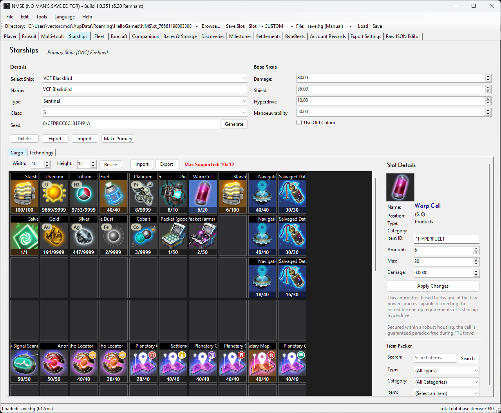
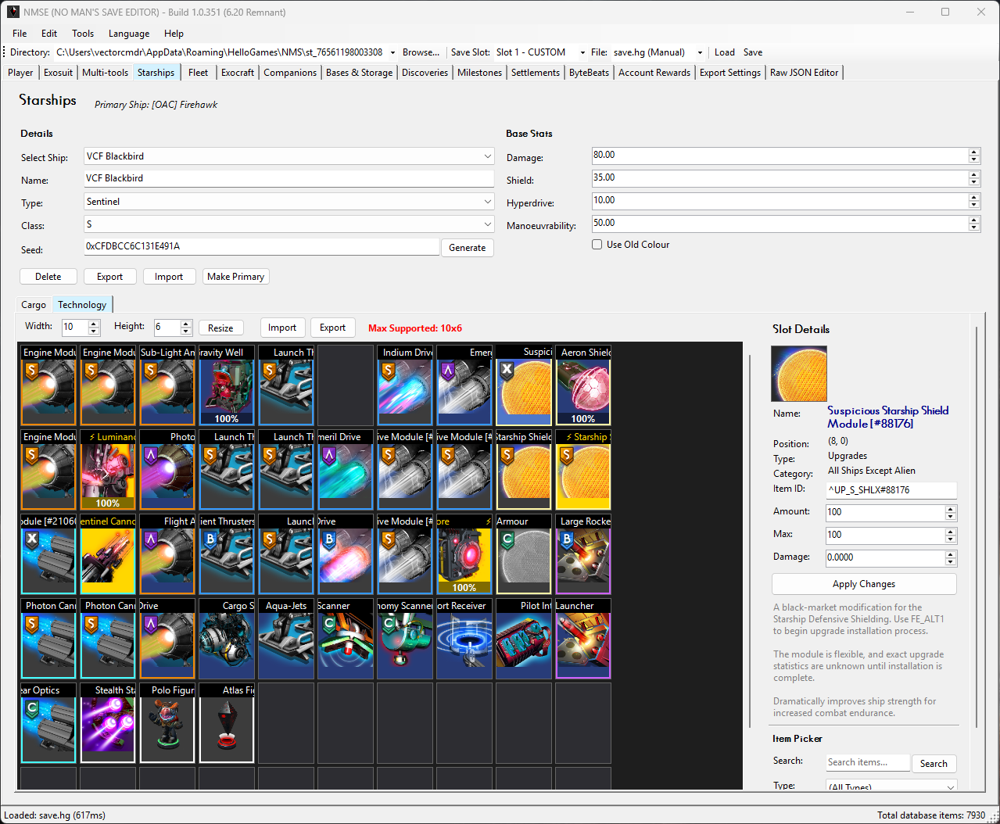
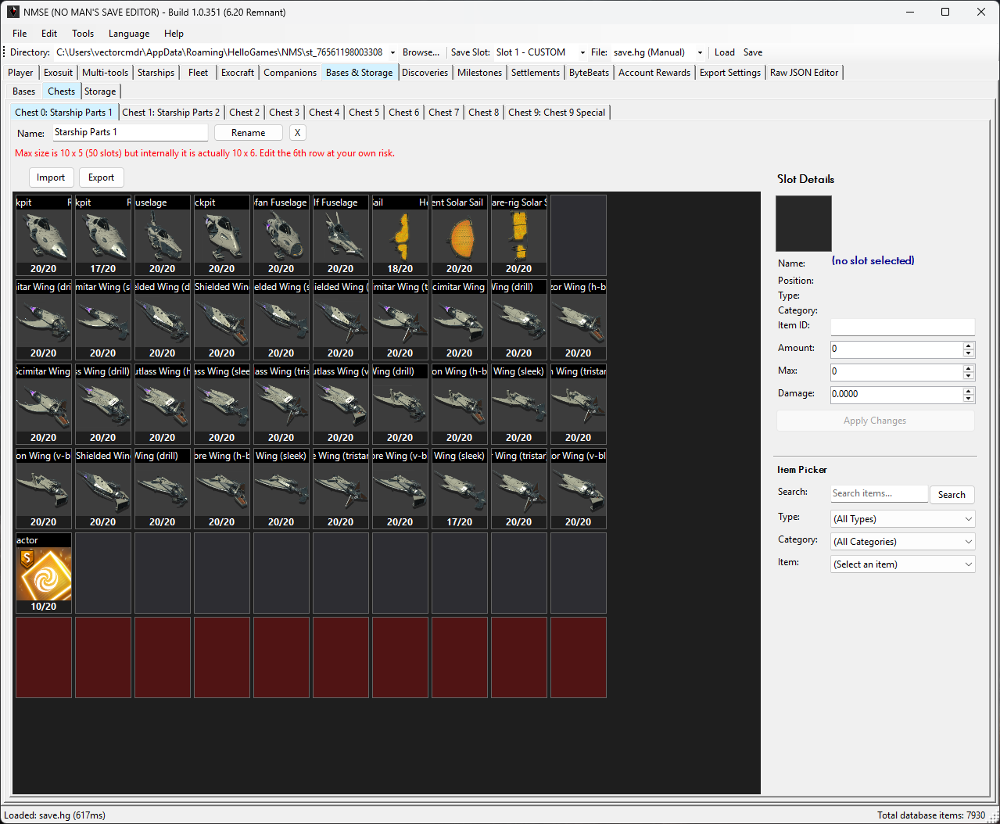

# NMSE User Guide

Welcome to **NMSE (NO MAN'S SAVE EDITOR)** - the open source No Man's Sky Save Editor. 
This guide walks you through every feature of the application so you can confidently edit your *No Man's Sky* save files.

---

## Table of Contents

- [Getting Started][getting-started]
- [Opening a Save File][opening-save]
- [Saving Your Changes][saving-changes]
- [Tabs Overview][tabs-overview]
- **Editing Guides:**
  - [Player Stats][player-stats]
  - [Exosuit][exosuit]
  - [Multi-tools][multitools]
  - [Starships][starships]
  - [Fleet (Freighter, Frigates & Squadron)][fleet]
  - [Exocraft (Vehicles)][exocraft]
  - [Companions (Pets)][companions]
  - [Bases & Storage][bases]
  - [Catalogue (Technologies, Products, Words, Glyphs, Locations, Fishing & Recipes)][catalogue]
  - [Milestones][milestones]
  - [Settlements][settlements]
  - [ByteBeats][bytebeat]
  - [Account Rewards][account]
  - [Export Settings][export-config]
  - [Raw JSON Editor][raw-json]
- [Importing & Exporting Inventories][import-export]
- [Changing Language][language]
- [Frequently Asked Questions][faq]

---

## Getting Started

### What You Need

- **Windows 10 or 11** (64-bit) _... or Linux (Wine, Bottles) and macOS (Gcenx Wine Builds, CrossOver)_
- A *No Man's Sky* save file from any supported platform

### Installing NMSE

1. Download the latest version from the [**Releases page**][releases]
2. Extract the `.zip` file to any folder on your computer
3. Double-click **`NMSE.exe`** to launch the editor

> 💡 No installation is required - NMSE is fully portable. You can run it from a USB drive or any folder.

While NMSE is a native Windows application, it runs on **Linux** and **macOS** via Wine compatibility layers. Guides are available for [Wine][guide-wine], [Bottles][guide-bottles], [Gcenx Wine Builds][guide-gcenx-wine], and [CrossOver][guide-crossover]. A native cross-platform version [is planned][cross-platform-plan].

### Supported Platforms

NMSE can edit save files from all platforms that *No Man's Sky* supports:

| Platform | Supported | Auto-Detect | Notes |
|----------|:-----------:|:-----------:|-------|
| Steam | ✅ | ✅ | Saves found automatically |
| GOG | ✅ | ✅ | Saves found automatically |
| Xbox Game Pass | ✅ | ✅ | Saves found automatically |
| PlayStation 4 | ✅ | - | Requires manual file transfer |
| Nintendo Switch | ✅ | - | Requires manual file transfer |

---

## Changing Language

NMSE supports the **16 game languages**. To change the display language:

1. Click **Language** in the menu bar
2. Select your preferred language from the list

The entire application - menus, labels, item names, and descriptions - will update to the selected language.

### Supported Languages

| Language | Code |
|----------|------|
| English (UK) | en-GB |
| English (US) | en-US |
| French | fr-FR |
| Italian | it-IT |
| German | de-DE |
| Spanish | es-ES |
| Spanish (Latin America) | es-419 |
| Portuguese | pt-PT |
| Portuguese (Brazil) | pt-BR |
| Russian | ru-RU |
| Polish | pl-PL |
| Dutch | nl-NL |
| Simplified Chinese | zh-CN |
| Traditional Chinese | zh-TW |
| Japanese | ja-JP |
| Korean | ko-KR |

---

## Opening a Save File

There are two ways to open a save file:

### Method 1: Open Save Directory (Recommended)

1. Click **File -> Open Save Directory** in the menu bar, or browse through the bar
2. NMSE will automatically detect your save file location
3. A list of available save slots will appear
4. Select the save slot you want to edit

### Method 2: Load Save File (Manual)

1. Click **File -> Load Save File**
2. Browse to the save file on your computer
3. Select the file and click **Open**

Use this method for PlayStation or Nintendo Switch saves that you've copied to your PC.

---

## Saving Your Changes

After making edits, save your changes using one of these methods:

- **File -> Save** - Overwrites the original file (a backup is created automatically)
- **File -> Save As** - Save to a new location without overwriting the original

> ⚠️ **Important:** While NMSE creates automatic backups, it's good practice to keep your own copy as well. Always keep a backup of your original save files before editing. 

### Restoring Backups

If something goes wrong, you can restore from a backup:

- **Edit -> Restore Backup (All)** - Restore all save slots from backup
- **Edit -> Restore Backup (Single)** - Restore just the current save slot

---

## Tabs Overview

NMSE organises all editing features into tabs along the top of the window. Click any tab to switch to that section.  
Most sections support export and import in different ways (with cross-editor compatibility).

| Tab | What It Does |
|-----|-------------|
| **Player** | Health, currencies, game mode, coordinates, guides, titles, save tools |
| **Exosuit** | Personal exosuit inventory and technology |
| **Multi-tools** | Multi-tool selection, stats, seeds, and inventory |
| **Starships** | Ship selection, stats, seeds, and inventory |
| **Fleet** | Freighter, frigates, and squadron stats, seeds, and inventories |
| **Exocraft** | Exocraft vehicle inventories |
| **Companions** | Companion management and creature creator |
| **Bases & Storage** | Bases and NPCs, chest inventories and storage containers |
| **Catalogue** | Words, glyphs, teleport locations, recipes, fish, product and technology catalogue |
| **Milestones** | Journey milestones and statistics |
| **Settlements** | Settlement management and building editor |
| **ByteBeats** | ByteBeat music library editor |
| **Account Rewards** | Platform and season rewards |
| **Export Settings** | Custom export/import settings |
| **Raw JSON Editor** | Advanced JSON tree editor for power users |

> 💡 **Tip:** Tabs load their data when you first click on them to save on initial load time, so switching tabs may take a brief moment the first time but won't again after that.

| General |
|-------|
|  |

---

## Player Stats

The **Player** tab lets you edit your character's core stats, game settings, unlocked guides and titles.

| General | Guide | Titles |
|-------|-------|-------|
|  |  |  |

### What You Can Edit (General Tab)

| Field | Description |
|-------|-------------|
| **Health** | Your current health value |
| **Shield** | Your current shield value |
| **Energy** | Your current energy value |
| **Units** | Basic in-game currency |
| **Nanites** | Nanite clusters currency for technology upgrades |
| **Quicksilver** | Premium currency earned from missions for synthesis |
| **Save Name** | The name of the save file |
| **Game Mode** | Normal, Survival, Permadeath, Creative, or Custom |
| **Player State** | Your current state (on foot, in ship, etc.) |
| **Space Battle** | Trigger a space battle event |

### Editing Coordinates

You can change your galactic position by editing the coordinate fields. This lets you teleport to specific systems or planets.

Current Coordinates shows your current location and details.  You can manually edit and apply coordinates from the right hand column via the number fields, or via glyph buttons. 
As an additional bit of fun, you can use the `Coordinate Roulette!` button to send yourself somewhere completely random (_you will be prompted to confirm_).

> ⚠️ **Caution:** Changing coordinates will move you to a different location in the galaxy. Make sure you know where you want to go!

### Advanced Save Utilities

You can copy, move slot, swap slot, delete and platform transfer a save from here.

> ⚠️ **Caution:** Ensure you have a backup of your save when using this utility! It performs complex operations for advanced users only.

### Guide Tab

You can set the status of guide topics in the games UI for your save from this panel. The filter search allows you to filter the list.

### Titles Tab

Allows the unlock of titles for your player.

---

## Exosuit

The **Exosuit** tab shows your personal inventory in a visual grid layout.

| Exosuit Cargo | Exosuit Tech |
|-------|-------|
|  |  |

### Inventory Sections

- **Cargo** - Main player cargo inventory
- **Technology** - Installed technology modules and upgrades

### Editing Inventory Slots

- **Click** on any slot to select it
- **Right-click** a slot to see available actions
- Use the item picker to change what's in a slot
- Edit stack sizes to change quantities
- Move items between slots by dragging
- Duplicate items into empty slots by using <kbd>ctrl</kbd>/<kbd>cmd</kbd> + dragging

### Adding Items

1. Click an empty slot
2. Use the item picker dialog to search for items
3. Select the item and confirm with <kbd>Apply Changes</kbd>

> 💡 **Tip:** You can search items by name using the search bar in the item picker.

### Resizing Inventory

- Change the width / height and use the <kbd>Resize</kbd> to confirm

### Export Import

- Cargo and Technology inventories allow you to export and import an inventory layout via the <kbd>Import</kbd> and <kbd>Export</kbd> buttons.

### Sort and Auto-Stack

- Exosuit Cargo has a <kbd>Sort</kbd> control at the top of the grid.
- The <kbd>Auto-Stack</kbd> button moves matching items from Exosuit Cargo to Chests, Starship Cargo, or Freighter Cargo.
- The Exosuit Cargo context menu can also auto-stack only the slot you right-clicked.
- You can pin a slot from the context menu. Pinned slots are ignored by auto-stack.
- If you use the single-slot auto-stack action on a pinned slot, the action is blocked.
- If the destination stack becomes full, the extra items go to another free slot in the same destination when possible.
- If there is no valid free slot, the remaining items stay in Exosuit Cargo.

---

## Multi-tools

The **Multi-tools** tab lets you manage your collection of multitools.

| Multi-tools |
|-------|
|  |

### What You Can Edit

| Field | Description |
|-------|-------------|
| **Name** | Your multitool's custom name |
| **Type** | Rifle, Pistol, Experimental, Alien, Royal, etc. |
| **Class** | C, B, A, or S class |
| **Seed** | The procedural generation seed (changes appearance etc.) |
| **Base Stats** | Damage, Mining, and Scan stats |
| **Inventory** | Technology slots, inventory resize, import / export |

Editing the inventory works the same as the other inventory panels (see Exosuit).

### Switching Multitools

Use the dropdown at the top to switch between your multitools. The inventory grid below will update to show the selected multitool's contents.

### Managing Multi-tools

Delete a multi-tool with the <kbd>Delete</kbd> button.

Export / Import via the <kbd>Export</kbd> and <kbd>Import</kbd> buttons.

Set the selected multi-tool to the primary multi-tool with the <kbd>Make Primary</kbd> button.

### Changing Multi-tool Seed

Changing the **Seed** value will change how your multi-tool looks and it's base stats. Each seed generates a unique combination of parts and colours. You can find seeds shared by the community online to get specific appearances.

> 💡 **Tip:** Write down your current seed or export your multi-tool before changing it, so you can go back if you don't like the new one!

---

## Starships

The **Starships** tab lets you manage up to 12 starships in your collection, including corvettes.

| Starship Cargo | Starship Tech |
|-------|-------|
|  |  |

### What You Can Edit

| Field | Description |
|-------|-------------|
| **Name** | Your ship's custom name |
| **Type** | Fighter, Explorer, Hauler, Shuttle, Exotic, Solar, Interceptor, Living Ship |
| **Class** | C, B, A, or S class |
| **Seed** | The procedural generation seed (changes appearance) |
| **Base Stats** | Damage, Shield, Hyperdrive, and Manoeuvrability stats |
| **Inventory** | Cargo and Technology slots, inventory resize, import / export |

### Switching Ships

Use the dropdown at the top of the panel to switch between your ships. Each ship has its own inventory grid.

### Managing Starships

Set the ship to use old colours via the <kbd>[ ] Use Old Colour</kbd>

Delete a ship with the <kbd>Delete</kbd> button.

Export / Import via the <kbd>Export</kbd> and <kbd>Import</kbd> buttons.

Set the selected ship to the primary starship with the <kbd>Make Primary</kbd> button.

### Cargo Sort and Auto-Stack

- Starship Cargo has a <kbd>Sort</kbd> control at the top of the grid.
- The <kbd>Auto-Stack</kbd> button in Starship Cargo moves matching items to Chests or Freighter Cargo.
- The Starship Cargo context menu can also auto-stack only the slot you right-clicked.
- You can pin a slot from the context menu. Pinned slots are ignored by auto-stack.
- If you use the single-slot auto-stack action on a pinned slot, the action is blocked.
- If the destination stack becomes full, the extra items go to another free slot in the same destination when possible.
- If there is no valid free slot, the remaining items stay in Starship Cargo.

### Changing Ship Appearance

Changing the **Seed** value will change how your ship looks and it's base stats. Each seed generates a unique combination of parts and colours. You can find seeds shared by the community online to get specific ship appearances.

> 💡 **Tip:** Write down your current seed or export your ship before changing it, so you can go back if you don't like the new one!

### Corvette Support

Corvette ships are supported with some special considerations:
- Corvettes work jankily in the game save data.
- Corvette ships have additional <kbd>Export</kbd> / <kbd>Import</kbd> and <kbd>Snapshot</kbd> buttons. Due to how corvettes work, you should summon your corvette and then set a new starship to primary before editing.
- NMS saves only store the Technology slots in the starship keys for your last actively docked Corvette(s). If you intend to edit a corvettes inventories, have it docked on your freighter or as your primary.
- Corvette inventory slots are reverse looked up from the base data to show the correct technology slots. If you don't see them, you need to cycle the corvette per above.
- NMSE has some safety prompts around these to help to guide you when editing corvette starships safely.

| Corvettes |
|-------|
|  |

---

## Fleet (Freighter, Frigates & Squadron)

The **Fleet** tab contains three sub-tabs for managing your capital ship (freighter) and fleet (frigate fleet and squadron).

### Freighter

Edit your freighter's stats, inventory, technology, and view the functional room list.

| Freighter Cargo | Freighter Tech | Freighter Rooms |
|-------|-------|-------|
|  |  |  |

| Field | Description |
|-------|-------------|
| **Name** | Your freighter's custom name |
| **Type** | Tiny, Small, Normal, Capital, Pirate |
| **Class** | C, B, A, or S class |
| **Seeds** | The procedural generation seeds (changes crew race, crew appearance, and freighter appearance + stats) |
| **Base Stats** | Hyperdrive and Fleet Coordination stats |
| **Inventory** | Cargo and Technology slots, inventory resize, import / export |
| **Rooms** | Freighter base room presence |

Export / Import via the <kbd>Export</kbd> and <kbd>Import</kbd> buttons.

- Freighter Cargo has a <kbd>Sort</kbd> control at the top of the grid.

### Frigates

Manage your fleet of up to 30 frigates by selecting them from the list.

| Frigates |
|-------|
|  |

| Field | Description |
|-------|-------------|
| **Name** | Frigate name |
| **Type** | Combat, Exploration, Industrial, Trade, Support, etc. |
| **Class** | C, B, A, or S class |
| **NPC Race** | Gek, Vy'keen, Korvax |
| **Seeds** | Home and Model seed (changes appearance + stats) |
| **Traits** | Special bonuses and abilities |
| **Stats** | Combat, exploration, industrial, and trade ratings |
| **Totals** | Total frigate outcome stats |
| **Progress / Mission** | Shows the current frigate mission and level state (Fast forward levels and finish expeditions with buttons) |

> 💡 **Tip:** Because traits determine class for frigates, changing a frigates class runs an algorithm to determine a set of stats for that class and changing traits updates the class.

Export / Import / Delete and Copy via the <kbd>Export</kbd> and <kbd>Import</kbd>, <kbd>Copy</kbd> and <kbd>Delete</kbd> buttons.

### Squadron

Edit your squadron of up to 4 pilots by selecting them from the list.

| Squadron |
|-------|
|  |

| Field | Description |
|-------|-------------|
| **Race** | Gek, Vy'keen, Korvax |
| **Rank** | C, B, A, or S class |
| **Ship Type** | The type of ship your wingman flies |
| **NPC Seed** | Pilot NPC seed (changes appearance) |
| **Ship Seed** | Pilot ship seed (changes appearance) |
| **Traits Seed** | Pilot NPC stats/traits (changes appearance) |
| **[ ] Slot Unlocked** | Pilot slot is unlocked |

Export / Import / Delete via the <kbd>Export</kbd>, <kbd>Import</kbd>, and <kbd>Delete</kbd> buttons.

---

## Exocraft (Vehicles)

The **Exocraft** tab lets you manage your exocraft vehicle inventories in the same manner as the other inventories. See Exosuit for more details. 
The inventories can be Resized, Imported and Exported via the width/height setters and <kbd>Resize</kbd> button, they can also be exported and imported via the <kbd>Export</kbd> and <kbd>Import</kbd> buttons.

| Exocraft Cargo | Exocraft Tech |
|-------|-------|
|  |  |

Each exocraft (Roamer, Nomad, Colossus, Pilgrim, Nautilon, Minotaur) has its own inventory section showing installed technology. 
(The unreleased Dragonfly can technically be added through JSON editing)

Use the dropdown at the top of the panel to switch between your ships. Each ship has its own inventory grid.

If the exocraft is currently deployed, it will be indicated on the panel and can be undeployed via the <kbd>Undeploy</kbd> button.

You can set the selected Exocraft to primary by using the <kbd>[ ] Primary Vehicle</kbd> toggle.

The camera state can be set using the <kbd>[ ] Third Person Camera</kbd> toggle.

The Minotaur AI Pilot can be enabled or disabled by using the <kbd>[ ] Minotaur AI Pilot</kbd> toggle.

Export / Import via the <kbd>Export</kbd> and <kbd>Import</kbd> buttons.

---

## Companions (Pets)

The **Companion** tab lets you manage your collection of pets / companions, as well as edit their parts and stats.

The system is complex and has some internal game constraints that can be hard to work with, so results may vary.

You can use the <kbd>Creature Builder (Web)</kbd> button above the list of companions and eggs to go to the NMSCD Creature Builder site, and import / set your companions per the site.

| Companions |
|-------|
|  |

### What You Can Edit

| Field | Description |
|-------|-------------|
| **[ ] Slot Unlocked** | Unlock / lock slot |
| **Species** | Your pet's species |
| **Name** | Your pet's custom name |
| **Type** | Companion type (internal names) |
| **Biomes** | Natural biome selection |
| **Predator [ ]** | Set predator state |
| **Has Fur [ ]** | Set fur state |
| **Scale** | Companion scale |
| **Trust** | Companion trust value |
| **Birth Time** | Companion time of birth |
| **Last Egg Time** | Companion last egg time |
| **Custom Species Name** | Custom species name |
| **Egg Modified [ ]** | Egg modification state |
| **Summoned [ ]** | Companion summoned state |
| **Allow Reroll [ ]** | Companion reroll state |
| **UA** | UA number |
| **Seeds** | Creature, secondary, species, genus, bone scale, colour base |
| **Stats** | Companion stats (Helpfulness, aggression, independence, hungry, lonely, trust increase/decrease dates) |

> 💡 **Tip:** The Descriptors / Parts can be edited depending on the selected species and type so that you can select different body part types. These are defined by what the game allows, so different companions will offer different options (some of which are fixed).

Export / Import / Delete via the <kbd>Export</kbd>, <kbd>Import</kbd>, and <kbd>Delete</kbd> buttons.

Additionally, the accessories of the companion can be reset via the <kbd>Reset Accessory</kbd> button.

---

## Bases & Storage

### Bases Tab

The **Bases** tab shows your base NPCs and their race and seed (editable), as well as your bases information (name).

Use the dropdown at the top of the Base Info section to switch between your bases.

Backup / Restore / via the <kbd>Backup</kbd> and <kbd>Restore</kbd> buttons.

You can move the base computer to another component's location via the <kbd>Move Base Computer</kbd> button. It will prompt you to select a base component by ID.

| Bases |
|-------|
|  |

### Chests Tab

You can edit the contents of your numbered storage chests / containers (0–9) via tabs. Each container has its own inventory grid with export, import and usual editing capabilities.

Chest inventories also have a <kbd>Sort</kbd> control at the top of the grid.

You can edit the names of your storage chests via the fields at the top of the tab.

| Chests |
|-------|
|  |

### Storage Tab

You can edit the contents of your special storage containers. Each container has its own inventory grid with export, import and usual editing capabilities.

| Storages |
|-------|
|  |

| Tab | Use |
|-------|-------------|
| **Ingredient Storage** | Ingredient storage inventory for cooking |
| **Corvette Parts Cache** | Corvette parts cache inventory for building corvette starships |
| **Base Salvage Capsule** | Salvaged parts capsule from deleted bases |
| **Rocket** | Rocket inventory |
| **Fishing Platform (Skiff)** | Fishing platforms inventory |
| **Fish Bait** | Fishing bait inventory |
| **Food Unit** | Food unit inventory for cooking |
| **Freighter Refund (unused)** | Freighter base deletion refund inventory - not used in the game, be careful if choosing to edit! (included for mod support) |

---

## Catalogue (Technologies, Products, Words, Glyphs, Locations, Fishing & Recipes)

The **Catalogue** tab manages your discovery progress and knowledge.

### Sections

Most of the tabs have functionality for:

Sorting and filtering with the headers and the filter search field.

Use the <kbd>Add {type}}</kbd> button to display a filterable list of items you can add to your known list.

The <kbd>Remove Selected</kbd> removes a known entry. Export / Import via the <kbd>Export</kbd> and <kbd>Import</kbd> buttons.

#### Known Technologies
View and manage the technology plans that you can craft or use.

| Known Technologies |
|-------|
|  |

#### Known Products
View and manage the technology plans that you can craft or use.

| Known Products |
|-------|
|  |

#### Known Words
View and manage the alien words you've learned from each race (Gek, Vy'keen, Korvax). 
You can learn / unlearn all words, all words for a specific race, a selection of words, or individually.

| Known Words |
|-------|
|  |

#### Known Glyphs
View and learn portal glyphs. You can learn / unlearn all 16 glyphs at once.

| Known Glyphs |
|-------|
|  |

#### Known Locations
Known locations are displayed in a list with their **Name**, **Type**, **Galaxy**, **Portal Code (Hex)**, **Portal Code (Dec)** and **Signal Booster** address.

| Known Locations |
|-------|
|  |

Entries can be filtered via the search and sorted via the headers.

Selecting an entry allows you to view the portal glyphs for that location as well as the galaxy it is in at the bottom of the tabs panel.

Use the <kbd>Delete Selected</kbd> button to delete the currently selected location(s).

Use the <kbd>Travel to System</kbd> button to set the players coordinates to this system and travel to it.

#### Fishing
Browse the fish you have caught and some basic stats. Add fish to your catch list via the <kbd>Add Fish</kbd> button. Remove them via the <kbd>Remove Selected</kbd> button.

Count and Largest Catch stats can be edited by changing their values.

| Fishing |
|-------|
|  |

#### Recipes
Browse a basic version of the complete recipe database. The **Recipes** sub-tab shows all crafting recipes with their ingredients, organised by type and offers filtering and sorting options. 
Additional information for the recipe is offered at the bottom of the tab panel.

| Recipes |
|-------|
|  |

---

## Milestones

The **Milestones** tab lets you view and edit your journey milestones and game statistics.

| Main Milestones | Other Milestones |
|------------|-------------|
|  |  |

You can edit milestone progress values and global statistics tracked by the game.

---

## Settlements

The **Settlement** tab lets you manage your settlements.

Select your settlement from the drop down menu.

Use the <kbd>Delete</kbd> button to delete a settlement. 
The settlement is not removed from your known locations (teleporter) on purpose, so that you can go back to that location if you want. It can be removed from the known locations panel.

Export / Import via the <kbd>Export</kbd> and <kbd>Import</kbd> buttons.

### Stats & Perks

| Stats & Perks |
|-------------|
|  |

| Field | Description |
|-------|-------------|
| **Name** | Selected settlement name |
| **Seed** | Settlement seed (appearance, stats) |
| **NPC Race** | Settlement NPC race |
| **Decision Type** | Settlements current decision event type |
| **Last Decision** | Settlements last decision event date |
| **Stats** | Settlement population, happiness, productivity, upkeep, sentinel buildup, debt, alert buildup, bug attack buildup |
| **Timers** | Timers for stats |
| **Mini Missions** | Mission seed and start time |
| **Perks** | Active settlement bonuses (seed field for procedural perks) |

Set values and timers from the available fields for each stats.

Select Perks from the list and enter a seed on the right hand side of the list for procedural perks.

### Production

| **Production** | What your settlement produces |

| Production |
|-------------|
|  |

Use the edit button to change what your settlement is producing.

### Building States

| **Building State Slots** | Edit the plots to change the status of the building in that plot |

| Building States |
|-------------|
|  |

For each plot (numbered 01 to 48), you can set the buildings status via the number entry field (or drop down list for known safe values).  
An approximation of the building is noted below the plots fields.

These are a bitflag composites that pack multiple bolleans and small numbers into a single integer. Editing these manually is for advanced users.

### Building Editor

| **Building Editor** | Edit an individual building/plots bitfields directly |

| Building Editor |
|-------------|
|  |

Select the plot via the slot field. You can set the buildings status via the raw value number entry field.  
The tick boxes below allow you to manipulate the bitflags in the bitfields within the composite integer. Each tickbox will manipulate the bits and produce the new integer to match.

This panel is for advanced users and requires either known useful values, or a solid understanding of the bitflags to net the most benefit.

---

## ByteBeats

The **ByteBeats** tab lets you manage your ByteBeat music library.

| ByteBeats |
|------------|
|  |

ByteBeat is No Man's Sky's built-in music creation tool. With NMSE, you can export, import, and manage your saved ByteBeat compositions - allowing you to share with other artists and enthusiasts online!

| Field | Description |
|-------|-------------|
| **Name** | Track name |
| **Author Username** | Track author username |
| **Author Online ID** | Track authors recorded online ID for the entry |
| **Author Platform** | Authors online / play platform ID (ST, PS, etc.) |
| **Data [ n ]** | Track data array |
| **[ ] Shuffle** | Shuffle playback |
| **[ ] Autoplay On Foot** | Playback selected track on foot |
| **[ ] Autoplay In Ship** | Playback selected track in ship |
| **[ ] Autoplay In Vehicle** | Playback selected track in vehicle |

Export / Import / Delete tracks via the <kbd>Export</kbd>, <kbd>Import</kbd>, and <kbd>Delete</kbd> buttons.

---

## Account Rewards

The **Account** tab shows seasonal reward (expedition), Twitch drops and platform specific rewards data.

| Account Rewards | Platform Rewards |
|------------|------------|
|  |  |

### What You Can Edit

| Field | Description |
|-------|-------------|
| **Season Rewards** | Expedition /season rewards |
| **Twitch Rewards** | Twitch Drop rewards |
| **Platform Rewards** | Platform-specific entitlements |

Each tab has the ability to unlock / lock all, unlock individually and filter the lists.

Platform rewards require the user settings MXML file to also be edited directly. It will auto find the file on supported platforms, if not browse to `GCUSERSETTINGSDATA.MXML` in the NMS `Binaries\SETTINGS\` directory

> 💡 **Tip:** Due to how the game works, Twitch drops and platform rewards, you need to set your game to offline before starting the game to unlock the rewards.

> 💡 **Tip:** You may also need to edit the platform rewards after launching the game (or lock the file from editing until after launch) due to how the game recreates the user settings MXML at runtime.

---

## Export Settings

The **Export Settings** tab lets you set up export naming conventions and file preferences.

| Export Extensions | Export Templates |
|------------|------------|
|  |  |

Configure how exported files are named and what format they use. This is useful if you frequently export and share save data or maintain custom collections of your save data.

Use the help sub tab for variable references.

---

## Raw JSON Editor

The **Raw JSON Editor** tab provides direct access to the underlying save file data in a tree view.

| Raw JSON Editor |
|------------|
|  |

### When to Use This

The Raw JSON editor is for **advanced users** who need to edit values that aren't exposed in the other tabs. It shows the complete save file structure as a navigable tree.

### How to Use

1. Navigate the tree by expanding nodes
2. Click on a value to edit it
3. Modify the value in the edit field
4. Press Enter to confirm the change

> 💡 **Tip:** The <kbd>Expand All</kbd> button will unfold up to half a million rows of keys and information depending on your saves age and density and can take a **very significant** amount of time to complete. It will warn you before you expand.

> ⚠️ **Caution:** Editing raw JSON values incorrectly can corrupt your save file. Only use this if you know what you're doing, and always keep a backup!

---

## Importing & Exporting Inventories

NMSE supports importing and exporting inventory data, making it easy to share loadouts with other players or make backups / inject into other items.

### Exporting

1. Navigate to the inventory you want to export (Exosuit, Ship, etc.)
2. Use the export function to save the inventory to a file

### Importing

1. Navigate to the target inventory
2. Use the import function and select your file
3. The items will be loaded into the inventory

### Compatibility

NMSE can import inventories, multi-tools, ships, etc. from multiple save editor formats via key-matching, so you can share loadouts even if your friends use different tools. 
Any keys that can be matched successfully will be imported.

---

## Frequently Asked Questions

### Where are my save files?

NMSE auto-detects save locations for Steam, GOG, and Xbox Game Pass. If auto-detect doesn't work, save files are typically located at:

- **Steam:** `%APPDATA%\HelloGames\NMS\`
- **GOG:** `%APPDATA%\HelloGames\NMS\`
- **Xbox Game Pass:** Search for `NMS` in the Xbox app data folder

### Can I edit PlayStation or Switch saves?

Yes! You'll need to transfer the save file to your PC first via the homebrew of your choice (PS4: Apollo, SaveWizard, etc. - Switch: JKSV, etc.), edit it with NMSE, then transfer it back. Use **File -> Load Save File** to open manually transferred saves.

### Will editing my save get me banned?

No Man's Sky does not have an anti-cheat system for save file editing. However, always use save editing responsibly and keep backups. 
We do not support or condone cheating or editing at the expense of others. Please be responsible!

### My save won't load - what do I do?

1. Make sure you're using the [latest version of NMSE][releases]
2. Check that your save is from a supported game version
3. Try restoring from a backup (**Edit -> Restore Backup**)
4. If the issue persists, [report a bug][issues-bug]

### Can I undo my changes?

You can restore from the automatic backup that NMSE creates when you save. Use **Edit -> Restore Backup** to go back to the last version before your edits.

---

**Need more help?** [Open an issue][issues-bug] or join the [community Discord][discord].

Made with ❤️ by [**vectorcmdr**][github-owner]

<!-- Link Definitions ----------------------------------->

<!-- Internal Navigation -->
[getting-started]: #getting-started
[opening-save]: #opening-a-save-file
[saving-changes]: #saving-your-changes
[tabs-overview]: #tabs-overview
[player-stats]: #player-stats
[exosuit]: #exosuit
[multitools]: #multi-tools
[starships]: #starships
[fleet]: #fleet-freighter-frigates--squadron
[exocraft]: #exocraft-vehicles
[companions]: #companions-pets
[bases]: #bases--storage
[catalogue]: #catalogue-technologies-products-words-glyphs-locations-fishing--recipes
[milestones]: #milestones
[settlements]: #settlements
[bytebeat]: #bytebeats
[account]: #account-rewards
[export-config]: #export-settings
[raw-json]: #raw-json-editor
[import-export]: #importing--exporting-inventories
[language]: #changing-language
[faq]: #frequently-asked-questions

<!-- Other Guides -->
[guide-wine]: ../dev/wine-linux-guide.md
[guide-bottles]: ../dev/bottles-linux-guide.md
[guide-gcenx-wine]: ../dev/gcenx-macos-guide.md
[guide-crossover]: ../dev/crossover-macos-guide.md
[cross-platform-plan]: ../dev/cross-platform-workplan.md

<!-- External Links -->
[releases]: https://github.com/vectorcmdr/NMSE/releases/latest
[issues-bug]: https://github.com/vectorcmdr/NMSE/issues/new?template=bug_report.md
[issues-feature]: https://github.com/vectorcmdr/NMSE/issues/new?template=feature_request.md
[github-owner]: https://github.com/vectorcmdr
[discord]: https://discord.gg/WbDQKKP3us
